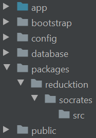

# Socrates

## Contributing

Create a new Laravel project:

```bash
composer create-project — prefer-dist laravel/laravel package-tester
```

Create `packages/reducktion` folders in the root of the project:



Now navigate to the package directory (`packages/reducktion`) and git clone the package:

```bash
git clone https://github.com/AlexOlival/socrates.git
```

All good to go! :grin:
